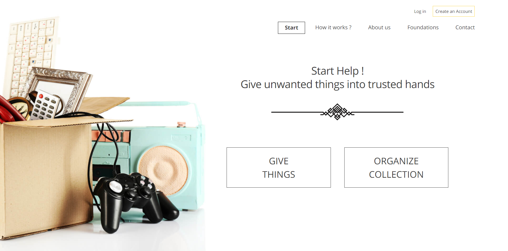
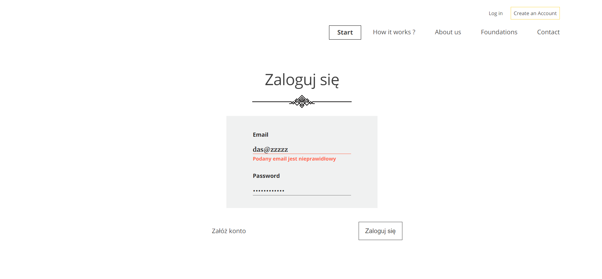

# Homemade Lumber

##Description

Main goal of the project is create a place 
where everybody will able to give back unused items
(clothes,toys etc.)
 to trusted institutions.
 
 ### Where did the idea come from ?
 
 * User have in home things which wants to get rid of
 but doesn't know how.
 
 * There are many solutions available, but many require additional effort or are not trusted.
 
 * Verified places usually are far and nobody has time to go there.
 
 So Homemade Lumber site goes against expectations and resolves this problem
 
 ####Status: in progress
 
 
 
 
 ## Setup
  How to start:
  
  To start development follow this instruction:
  
  * `clone` this repo
  * `npm install` all necessary npm packages
  * `npm start` to start project
  
  ## Technologies
  * RWD
  * SASS
  * HTML 
  * JavaScript (ES6)
  * React
  * React Router
  